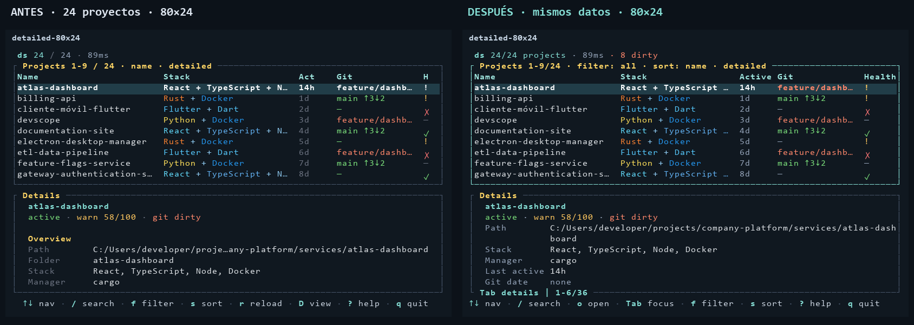

# Devscope: antes y después

Comparación con los mismos 24 proyectos de prueba: nombres, rutas y ramas largos, varios stacks, Git limpio/sucio/ausente, notas extensas y salud variada. Las imágenes reconstruyen las celdas y estilos del renderer real de ratatui; no son datos personales ni mockups. El fondo y la fuente son de referencia y pueden diferir del terminal instalado.

El encabezado vuelve a ocupar una fila. Projects contiene filtro, orden, vista y búsqueda activa sobre su borde. En 80×24 se conservan los nueve proyectos visibles originales, y el nombre no se repite como campo de detalles. Se mantienen el desplazamiento y los menús corregidos.

## Pantallas actuales

| Escenario | Antes | Después |
|---|---|---|
| Detallada, 80×24 | [Captura](before/detailed-80x24.png) | [Captura](after/detailed-80x24.png) |
| Detallada, 125×30 | [Captura](before/detailed-125x30.png) | [Captura](after/detailed-125x30.png) |
| Detallada, 160×45 | [Captura](before/detailed-160x45.png) | [Captura](after/detailed-160x45.png) |
| Lista compacta | [Captura](before/compact-160x45.png) | [Captura](after/compact-160x45.png) |
| Selección intermedia | [Captura](before/selected-middle-100x30.png) | [Captura](after/selected-middle-100x30.png) |
| Ayuda | [Captura](before/help-80x24.png) | [Captura](after/help-80x24.png) |
| Apertura | [Captura](before/open-80x24.png) | [Captura](after/open-80x24.png) |
| Apertura en ventana baja | [Captura](before/open-80x12.png) | [Captura](after/open-80x12.png) |
| Nota larga | [Captura](before/note-80x24.png) | [Captura](after/note-80x24.png) |
| Búsqueda confirmada | [Captura](before/retained-search-80x24.png) | [Captura](after/retained-search-80x24.png) |
| Sin coincidencias | [Captura](before/no-results-100x30.png) | [Captura](after/no-results-100x30.png) |

Además se verifican [final de detalles](after/details-bottom-80x24.png), [final de ayuda](after/help-bottom-80x24.png), [errores](after/error-80x24.png) y [tema claro](after/light-160x45.png).

La [galería HTML](index.html) permite comparar todos los escenarios al abrir el archivo localmente en un navegador. GitHub muestra el HTML como código; las capturas enlazadas arriba pueden revisarse directamente allí. La fuente usada para reconstruir las imágenes puede mostrar cajas en ciertos caracteres japoneses; eso no demuestra que fallen en el terminal.

Validación: 138 pruebas normales, siete escenarios de terminal real y 81,41 % de cobertura de líneas instrumentadas. [Datos de rendimiento](performance.json): diez ejecuciones alternadas de la primera revisión frente a la versión compacta, con configuración idéntica y caché ya utilizada. No son mediciones de arranque en frío ni prueba de una mejora causal.
